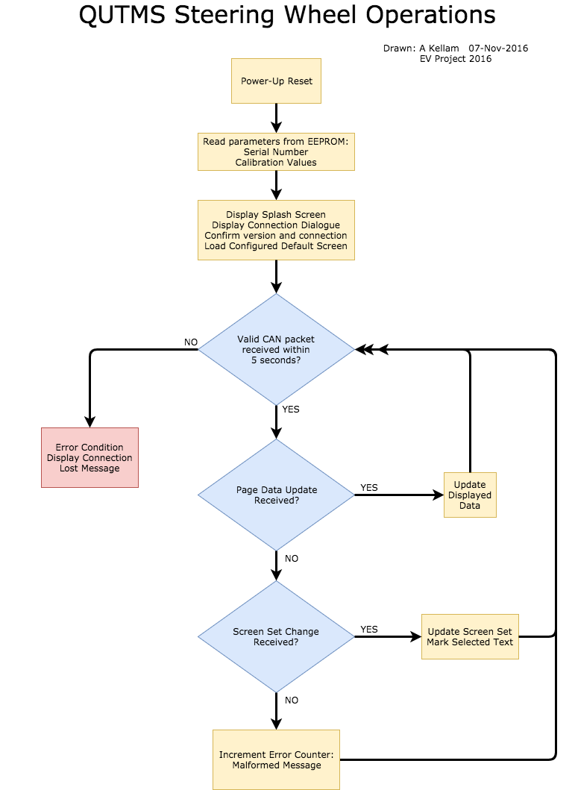

# Steering Wheel Software

The steering wheel could be considered a dumb terminal that shows the status of the car. It will be the only way to view the systems in the car aside from the C# program.

It will allow you to shift though the multiple modes that the Chassis Controller ([QUTMS_ChassisController](https://github.com/Technosasquach/QUTMS_ChassisController "QUTMS_ChassisController")) is capable off. It would then update the display and dash to what is best suited for the mode. Additonaly it could be programmed with different interfaces that show various elements of the car to the driver while racing. 

If you are working on this code, then its recommended that you talk to someone that would be driving, so you can tailor the software to their needs.

Below is a rough outline of its operations procedures.

